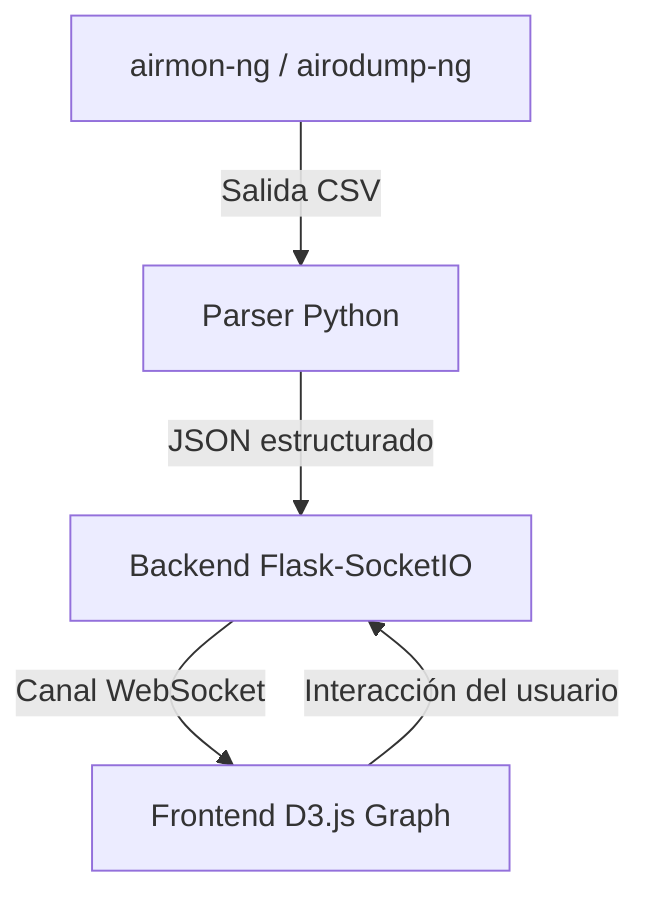

## **Black Swan: The Invisible Threat Visualizer**

> *"When the attack is silent, invisible, and real… you need a new way to see."*


* * *


### 🦢 **Black Swan**

La primera herramienta de visualización ofensiva WiFi, inspirada en BloodHound, que te permite mapear redes inalámbricas en tiempo real, identificar objetivos críticos y lanzar ataques desde la propia interfaz gráfica.

* * *

## ❓ ¿Por qué nace Black Swan?

El WiFi sigue siendo el **eslabón más débil de la seguridad digital moderna**.  
Redes con WPA2/WPA3 mal configuradas, clientes expuestos, dispositivos IoT inseguros…

Y lo peor: **todo esto se puede escanear sin levantar una sola alarma.**

El Recon WiFi es:

- Pasivo
    
- Silencioso
    
- Invisible para el administrador de red
    

**Black Swan convierte ese silencio en visibilidad.**  
Con una visualización inspirada en el estilo gráfico de BloodHound, llevamos la guerra aérea digital a un nuevo nivel.

* * *

## 🧠 ¿Qué hace diferente a Black Swan?

| Característica | Descripción |
| --- | --- |
| 🔎 Visual Recon | Escanea redes y dispositivos con `airodump-ng`, parsea CSV y genera un grafo |
| 🧬 Score Inteligente | Calcula vulnerabilidad por señal, cifrado y clientes conectados |
| 🧠 Defensivo y Ofensivo | Sirve tanto para monitorear que no tenes una amenaza desconocida como para red team | |
| 🧿 Interfaz hacker moderna | Grafo real en D3.js + backend FastAPI + scripts shell/python |

* * *

## 🛡️ ¿Por qué importa esto?

> "Si tu red WiFi se ve vulnerable desde afuera… es porque **ya está siendo observada**."

Black Swan no es una amenaza.  
Es una **alerta visual**.

Una herramienta para entender cómo un atacante ve tu red.  

* * *

## ⚙️ Requisitos del sistema

| Componente | Versión mínima | Descripción |
| --- | --- | --- |
| 🐍 Python | 3.9+ | Usado para el backend (Flask + SocketIO) |
| 🧠 Node.js | 18+ | Usado para compilar y correr el frontend |
| 📡 aircrack-ng | Última estable | Necesario para escanear y modo monitor |
| 💻 Sistema operativo | Kali / Debian / Ubuntu | Probado en Kali 2025.3 |
| 🌐 Navegador | Chrome / Firefox | Visualización del grafo D3.js |

* * *

## 📂 Estructura del proyecto

```BlackSwan/
├── backend/
│   └── recon/
│       ├── main.py
│       ├── deploy.sh
│       ├── restart_service.sh
|       ├── stop_service.sh 
│       └── uninstall/sh
├── frontend/
│   ├── src/
│   ├── public/
|   ├── App.css 
|   ├── App.jsx
│   └── package.json
├──start.sh 
└── README.md
```

## Instalación

`git clone git@github.com:CarlosNadal/BlackSwan.git`


## 📦 Deploy rápido — `deploy.sh`

**Resumen:** `deploy.sh` instala dependencias (aircrack-ng, Python3), crea y activa un `venv`, instala paquetes Python necesarios (`flask`, `flask-socketio`, `flask-cors`, `eventlet`), genera un unit file systemd `/etc/systemd/system/blackswan-wifi.service` y habilita/inicia el servicio.

### Uso
Ejecutar desde la carpeta backend/recon:

* `cd backend/recon`
* `sudo ./deploy.sh`
### Qué hace (paso a paso)

1.  **Comprueba permisos** — requiere `root` (detiene si no se ejecuta con `sudo`).
    
2.  **Instala dependencias del sistema** — comprueba `airodump-ng` (instala `aircrack-ng` si falta) y `python3` (+ venv/pip).
    
3.  **Crea y activa `venv`** — crea `venv` local si no existe.
    
4.  **Instala dependencias Python** — `pip install -r` implícito: `flask`, `flask-socketio`, `flask-cors`, `eventlet`.
    
5.  **Crea unit file systemd** — `/etc/systemd/system/blackswan-wifi.service` apuntando al `venv` y a `main.py`. Variables por defecto: `INTERFACE=wlan0`, `PORT=8000`.
    
6.  **Recarga systemd y arranca** — `systemctl daemon-reload`, `enable` + `restart` del servicio.
    
7.  **Verificación** — chequeo de importaciones Python y estado `systemctl is-active`. Si falla, sugiere revisar logs.

### Comandos utiles tras deploy 

* `sudo systemctl status blackswan-wifi    # Ver estado del servicio`
* `sudo journalctl -u blackswan-wifi -f    # Ver logs en tiempo real`
* `sudo systemctl stop blackswan-wifi      # Detener servicio`
* `sudo systemctl restart blackswan-wifi   # Reiniciar servicio`
* `sudo systemctl disable blackswan-wifi   # Deshabilitar inicio automático`

* * *

▶️ start.sh — Levantar monitor, frontend y backend

**Resumen:** `start.sh` prepara la interfaz Wi-Fi en modo monitor (airmon-ng), arranca el frontend (localhost:5173) y arranca el backend (backend/recon/main.py) en primer plano, guardando logs en /tmp/blackswan_logs. Arranca todo en una sola orden y deja Ctrl+C para detener y restaurar el sistema.

**Uso:**
Desde la raíz del repo (donde está start.sh):

`sudo ./start.sh`

## ¿Qué hace paso a paso?

1.  **Comprobaciones básicas**
    
    - Verifica que se ejecute como `root` (necesario para manipular interfaces).
        
    - Comprueba que existan `airmon-ng`, `iw` y `python3`.
        
2.  **Detecta la carpeta del frontend**
    
    - Busca automáticamente carpetas comunes: `Frontend`, `frontend`, `UI`, `ui`, `frontend-app`. Si no la encuentra, avisa y continúa (el backend sigue arrancando).
    - 
3.  **Pone la tarjeta Wi-Fi en modo monitor**
    
    - Ejecuta `airmon-ng check kill` (esto *puede* matar NetworkManager y otros servicios que gestionen redes).
        
    - Ejecuta `airmon-ng start $INTERFACE`. Si el modo monitor ya estaba activo, lo detecta; si no, intenta averiguar el nombre de la interfaz monitor (`wlan0mon`, `wlan0mon`, `mon0`, etc.) a partir de la salida del comando.
        
    - Informa la interfaz monitor detectada en pantalla (`MON_IF`).
        
4.  **Arranca el frontend**
    
    - Si encuentra la carpeta del frontend, entra, instala dependencias (`npm ci` o `npm install`) y lanza `npm run dev`. El log del frontend se guarda en `/tmp/blackswan_logs/frontend_YYYYMMDD_HHMMSS.log`.
5.  **Arranca el backend**
    
    - Entra en `backend/recon`, activa el `venv` si existe (busca `./venv` o `../venv`), y ejecuta `python3 main.py`.
        
    - El log del backend se guarda en `/tmp/blackswan_logs/backend_YYYYMMDD_HHMMSS.log`.
        
6.  **Loop de supervisión**
    
    - Muestra PIDs y logs. Mantiene un loop que comprueba si frontend o backend terminan inesperadamente; si eso sucede, ejecuta la rutina `cleanup()`.
7.  **Cleanup (al presionar Ctrl+C o error)**
    
    - Mata procesos frontend/backend si siguen vivos.
        
    - Detiene la interfaz monitor (`airmon-ng stop <MON_IF>`) e intenta restaurar NetworkManager (`systemctl restart NetworkManager`) para devolver la máquina a su estado original.
        

* * *

## Precauciones importantes (léelas)

- **Requiere `root`**: modifica interfaces y puede detener NetworkManager. Úsalo en VM/lab o en una máquina de pruebas.
    
- **`airmon-ng check kill` mata servicios** como NetworkManager, wpa_supplicant, etc. `start.sh` intenta restaurarlos al terminar, pero puede fallar — por eso probar en VM es lo ideal.
    
- **Nombre de interfaz:** el script usa `INTERFACE="wlan0"` por defecto. Cambialo si tu tarjeta tiene otro nombre (`wlan1`, `wlp2s0`, etc.) antes de ejecutar.
    
- **Logs temporales:** los logs están en `/tmp/blackswan_logs`. No son permanentes; mové o rotá si querés conservarlos.
    
- **No es para producción:** Black Swan esta pensado para visualizar y educar acerca del WI-FI pentesting.

## Archivos/variables importantes dentro del script

- `BACKEND_DIR="backend/recon"` — ruta relativa donde está el backend.
    
- `POSSIBLE_FRONT_DIRS` — lista de nombres que busca para el frontend.
    
- `LOG_DIR="/tmp/blackswan_logs"` — carpeta donde guarda logs (asegúrate de espacio).
    
- `INTERFACE="wlan0"` — interfaz física a convertir a monitor. Cambiala según tu HW.
    
- `MON_IF` — nombre de la interfaz en modo monitor detectada por el script.

* * *

## 🧩 Arquitectura técnica



💡 **Resumen:**

- El backend convierte datos de `airodump-ng` en un flujo JSON en tiempo real.
    
- El frontend D3.js los renderiza como un grafo interactivo de puntos de acceso y clientes.
    
- Todo se actualiza dinámicamente vía **WebSockets**.
    

* * *

## 📜 Licencia

Este proyecto está licenciado bajo **MIT License**.  
Podés usarlo, modificarlo y compartirlo libremente, siempre citando su origen.

> *Black Swan — ver lo invisible, entender lo inaudito.*
## 📢 Llamado a la comunidad

Black Swan es **100% open source**.  
Está pensado para la comunidad WiFi, pentesters, docentes y entusiastas.

Si querés colaborar con visualización, scripting, backend o simplemente probar…  
Bienvenido al nido.
    

* * *

## 🖤 Porque los verdaderos ataques...

...no hacen ruido.  
Solo dejan vulnerabilidades al descubierto.

 **Black Swan** — visualizá lo invisible.

