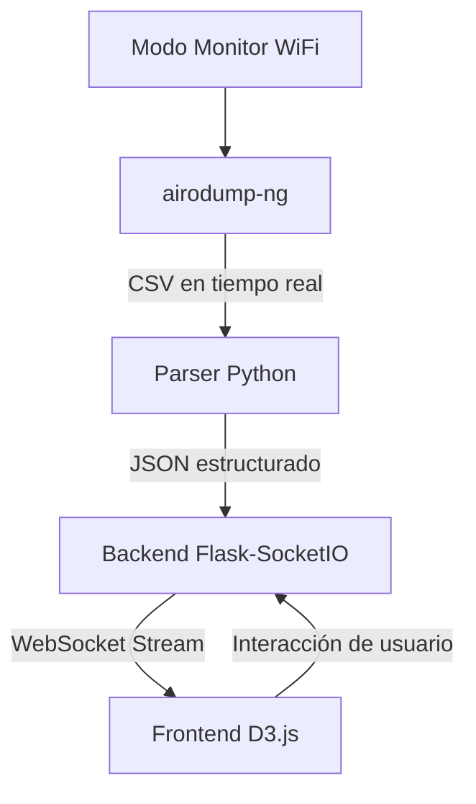

# **Black Swan: The Invisible Threat Visualizer**

> *"When the attack is silent, invisible, and real… you need a new way to see."*


## 🦢 **¿Qué es Black Swan?**

La primera herramienta de visualización ofensiva WiFi, inspirada en BloodHound, que transforma el reconocimiento wireless en un mapa interactivo en tiempo real. Identifica puntos de acceso vulnerables, clientes expuestos y relaciones de red críticas con una visualización tipo grafo.

> **"Si tu red WiFi se ve vulnerable desde afuera… es porque ya está siendo observada."**

* * *

## 🚀 **Comenzar en 3 Minutos**

### Prerrequisitos
- Tarjeta WiFi compatible con modo monitor
- Sistema Linux (Kali/Debian/Ubuntu)
- Permisos de root

### 📥 Instalación Rápida

```bash
# 1. Clonar el repositorio
git clone git@github.com:CarlosNadal/BlackSwan.git
cd BlackSwan
```

### 🎯 **Elige Tu Método de Ejecución**

#### **Método 1: Sesión Única** (`start.sh`) - *Para pruebas*
```bash
# Ejecuta todo en una terminal (interfaz + backend + modo monitor)
sudo ./start.sh

# Luego abre: http://localhost:5173
```
**Perfecto para:** Pruebas rápidas, demostraciones, desarrollo

#### **Método 2: Servicio Persistente** (`deploy.sh`) - *Para laboratorio*
```bash
# Instala como servicio systemd (inicio automático)
cd backend/recon
sudo ./deploy.sh

# Verificar instalación
sudo systemctl status blackswan-wifi

# Para usar la interfaz, regresa al directorio principal y ejecuta:
cd ../..
./start.sh  # Esto levantará el frontend y conectará con el servicio

# Luego abre: http://localhost:5173
```
**Ideal para:** Uso continuo, laboratorios, entornos controlados

### 🎮 **Comandos Esenciales Post-Instalación**

```bash
# Gestión del servicio
sudo systemctl status blackswan-wifi    # Estado del servicio
sudo journalctl -u blackswan-wifi -f    # Logs en tiempo real
sudo systemctl restart blackswan-wifi   # Reiniciar servicio
sudo systemctl stop blackswan-wifi      # Detener servicio
```

* * *

## ❓ **¿Por qué Black Swan Existe?**

El WiFi sigue siendo el **eslabón más débil** en la seguridad digital. Mientras las defensas perimetrales se fortalecen, el espectro wireless permanece como un canal de ataque:

- **Pasivo**: Escaneo sin detección
- **Silencioso**: Zero packets hacia la red objetivo  
- **Invisible**: Indetectable para administradores

**Black Swan convierte esa invisibilidad en visibilidad**, aplicando el concepto de "Attack Path Mapping" de BloodHound al dominio wireless.

### 🎯 **Casos de Uso**

| Rol | Beneficio |
|-----|-----------|
| **Pentester** | Identificar vectores de entrada WiFi |
| **Blue Team** | Auditar exposición wireless propia |
| **Investigator** | Visualizar relaciones dispositivo-red |
| **Educator** | Enseñar riesgos WiFi de forma visual |

* * *

## ✨ **Características Principales**

| Característica | Impacto |
|----------------|---------|
| **🔎 Visual Recon en Tiempo Real** | Mapa vivo de redes y dispositivos |
| **🧬 Score de Vulnerabilidad Inteligente** | Priorización automática de objetivos |
| **🎯 Interfaz Tipo BloodHound** | Navegación intuitiva de grafos complejos |
| **⚡ Actualización en Vivo** | Websockets para datos en tiempo real |
| **🛠️ Arquitectura Modular** | Backend Python + Frontend D3.js |

* * *

## 🏗️ **Arquitectura Técnica**



### 📚 **Stack Tecnológico**

- **Backend**: Python + Flask + SocketIO
- **Frontend**: D3.js + React + Vite  
- **Wireless**: aircrack-ng suite
- **Despliegue**: Systemd + bash scripting

* * *

## 📂 **Estructura del Proyecto**

```
BlackSwan/
├── 🔧 backend/recon/
│   ├── main.py              # Servidor principal Flask
│   ├── deploy.sh            # Instalador sistema
|   ├── stop-service.sh      # Detiene el servicio
|   ├── uninstall.sh         # Desinstalar el servicio         
│   └── restart_service.sh   # Utilidades gestión
├── 🎨 frontend/
│   ├── src/                 # Código React/D3.js
│   ├── public/              # Assets estáticos
│   └── package.json
├── 🚀 start.sh              # Lanzador todo-en-uno
└── 📖 README.md
```

* * *

## ⚠️ **Precauciones de Seguridad**

### 🛡️ **Consideraciones Críticas**

- **Requiere Root**: Manipulación de interfaces wireless
- **Entorno Controlado**: Usar en VM/laboratorio aislado
- **Legalidad**: Solo en redes propias o autorizadas
- **Impacto Network**: `airmon-ng` puede interrumpir conectividad

### 🔒 **Mejores Prácticas**

```bash
# Usar en máquina dedicada
# Verificar leyes locales antes de escanear
# Documentar autorizaciones por escrito
# Aislar en red de laboratorio
```

* * *

## 🐛 **Solución de Problemas**

### Problemas Comunes y Soluciones

**Interfaz no detectada:**
```bash
# Verificar interfaces disponibles
iwconfig
# Cambiar INTERFACE en start.sh
nano start.sh  # INTERFACE="wlan0" → tu_interfaz
```

**Faltan dependencias:**
```bash
# Instalar aircrack-ng manualmente
sudo apt update && sudo apt install aircrack-ng
```

**Servicio no inicia:**
```bash
# Ver logs detallados
sudo journalctl -u blackswan-wifi -n 50
```

* * *

## 🤝 **Contribuir al Proyecto**

Black Swan es **100% open source** y crece con la comunidad.

### **Áreas de Colaboración**
- 🎨 Mejoras de visualización D3.js
- 🔧 Nuevos parsers de datos wireless
- 📡 Soporte para más herramientas (kismet, etc.)
- 🧪 Testing y reporte de bugs

### **Guía de Contribución**
1. Fork el proyecto
2. Crea tu feature branch (`git checkout -b feature/AmazingFeature`)
3. Commit tus cambios (`git commit -m 'Add some AmazingFeature'`)
4. Push al branch (`git push origin feature/AmazingFeature`)
5. Abre un Pull Request

* * *

## 📜 **Licencia**

Distribuido bajo **MIT License**. Ver [LICENSE](LICENSE) para más detalles.

> **"La verdadera seguridad no es ocultar las vulnerabilidades, sino entenderlas tan bien que pierdan su poder."**

* * *

## 🌟 **Roadmap Futuro**

- [ ] Soporte para más formatos de captura (pcap, kismet)
- [ ] Análisis de handshakes integrado
- [ ] Módulos de ataque visualizados
- [ ] Exportación de reportes profesionales
- [ ] Dashboard de métricas de seguridad

* * *

## 📞 **Soporte y Comunidad**

- **Issues**: [GitHub Issues](https://github.com/CarlosNadal/BlackSwan/issues)
- **Discusiones**: [GitHub Discussions](https://github.com/CarlosNadal/BlackSwan/discussions)
- **Contribuciones**: PRs siempre welcome

---

<div align="center">

**Black Swan** - Porque los verdaderos ataques no hacen ruido, solo dejan vulnerabilidades al descubierto.

</div>
